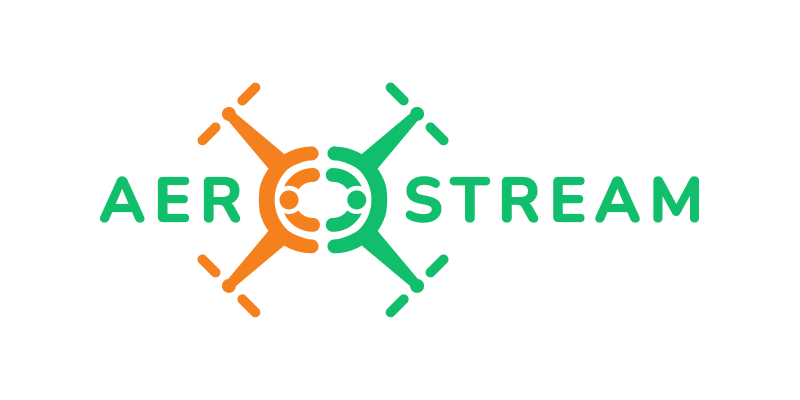

# offboard_control_example

This package send position setpoints to PX4.

## Configure the setpoints

In `config/position_control.yaml`  you can change and add position setpoints.

```yaml
position_control:
  ros__parameters:
    # Position: [ X, Y, Z, Yaw, Duration ]

    sp0: [  0.0,   0.0,   -1.5,  0.0,  10.0 ]
    sp1: [  0.0,   0.0,   -1.5,  0.0,  5.0  ]
    sp2: [  0.0,   0.5,   -1.5,  0.0,  5.0  ]
    sp3: [  0.5,   0.5,   -1.5,  0.0,  5.0  ]
    sp4: [  0.5,   0.0,   -1.5,  0.0,  5.0  ]
    sp5: [  0.0,   0.0,   -1.5,  0.0,  5.0  ]
    sp6: [  0.0,   0.0,    0.0,  0.0,  5.0  ]
```

## Launch 

```shell
ros2 launch offboard_control_example position_control.launch.py
```

## Acknowledgment

This training material was prepared and delivered as part of the Horizon Europe CSA project: AeroSTREAM (Grant Agreement number: 101071270).

<p align="center">
  
</p>